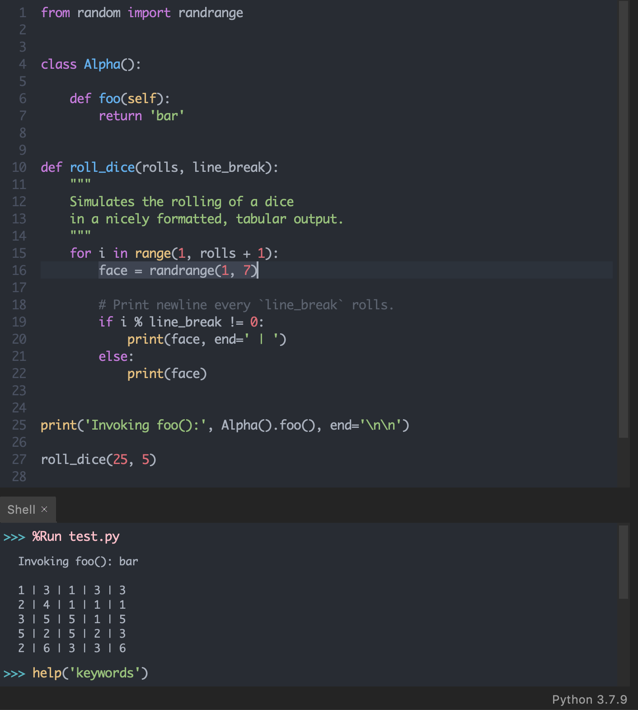

# One Dark theme for [Thonny IDE](https://thonny.org)

> A dark theme for [Thonny IDE](https://thonny.org).

## Installation

#### Install using Thonny

1. Go to `Thonny → Tools → Manage plug-ins`
2. Search for `thonny-onedark`
3. Click `Install`

#### Install using pip

    $ pip install thonny-onedark

#### Install manually

1. Download using the [GitHub .zip download](https://github.com/ranelpadon/thonny-onedark/archive/refs/heads/main.zip) option and unzip them.
2. Go to `Thonny → Tools → Manage plug-ins…`
3. Click `Install from local file`
4. Find and select the prefered compressed file under the `dist/` folder

#### Activating theme

1. After installing, close and open Thonny, so the theme is loaded
2. Go to `Thonny → Tools → Options`
3. Under `Theme & Font`, select the drop-down menu `Syntax theme`
4. Select `One Dark`

## License

[MIT License](./LICENSE)
